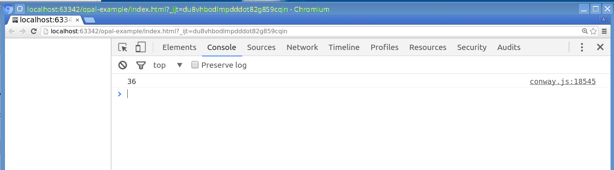

# Overview

## Based on

Example Conway's Game of Life in Opal:
* https://www.sitepoint.com/opal-ruby-browser-basics/

Fix for Rakefile:
* https://github.com/opal/opal.github.io/issues/2

## (RE-)Build

##### manually:

```
rake build
```

##### automatially (via Guard):

```
bundle exec guard
```

(Pressing <Enter> will force a re-build.)

## (RE-)Run

Open `index.html` in browser.

# Tutorial Steps

## Initial Setup

### Sum of Cubes

See files under `doc/example_steps/1_sum_of_cubes`


