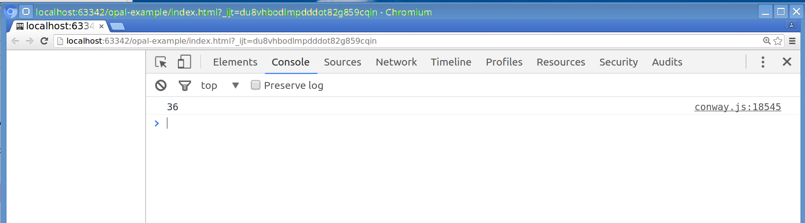
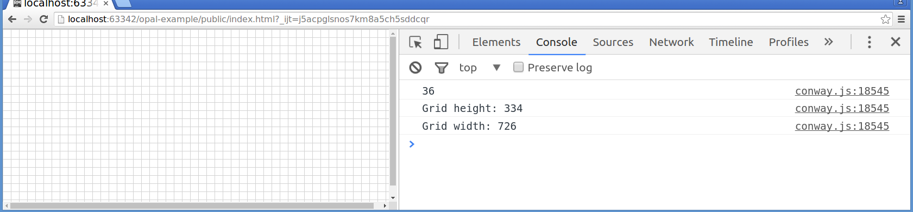
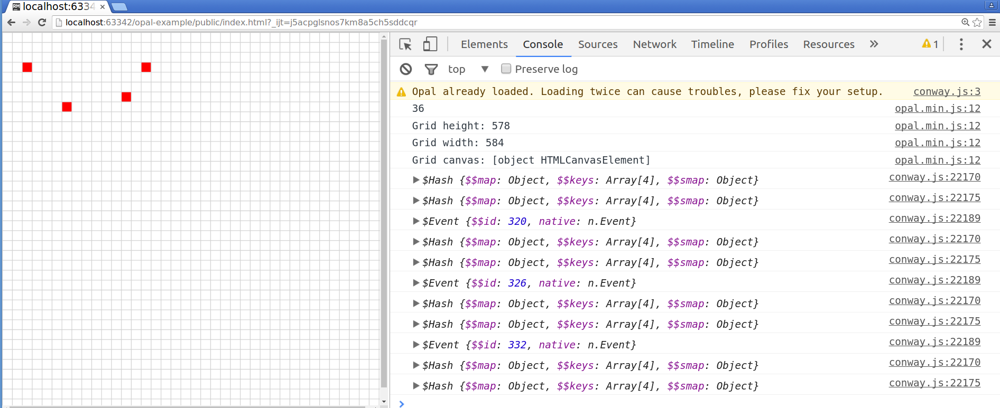
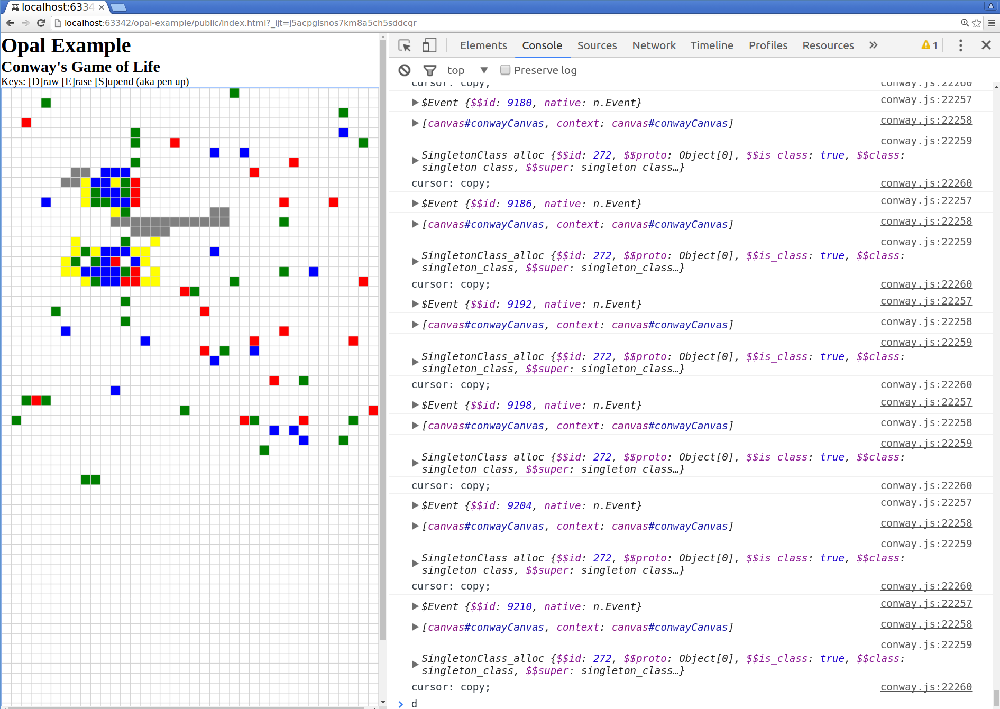

# Overview

## Based on

Example Conway's Game of Life in Opal:
* https://www.sitepoint.com/opal-ruby-browser-basics/

Fix for Rakefile:
* https://github.com/opal/opal.github.io/issues/2

## (RE-)Build

##### manually:

```
rake build
```

##### automatially (via Guard):

```
bundle exec guard
```

(Pressing <Enter> will force a re-build.)

## (RE-)Run

Open `index.html` in browser.

# Tutorial Steps

## Initial Setup & 'Sum of Cubes':

A simple Hello World via outputting a sum of cubes to the JS console.

See files under `doc/example_steps/0_sum_of_cubes`



## Drawing a Blank Grid

Grid lines to cover entire growser viewport.

See files under `doc/example_steps/1_drawing_blank_grid`



## Adding Some Interactivity

Click a cell to fill or clear it.

See files under `doc/example_steps/2_click_to_toggle`



# Custom Steps

## Simple Drawing Pad

Click a cell to fill or clear it.

See files under `doc/example_steps/3_draw_modes_and_colors`



--------
# See also:
* [Opal](http://opalrb.org/)
* [Wrapping JavaScript library with Opal](https://ilyabylich.svbtle.com/wrapping-javascript-library-with-opal)
